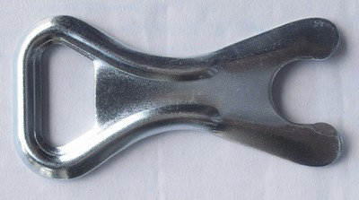
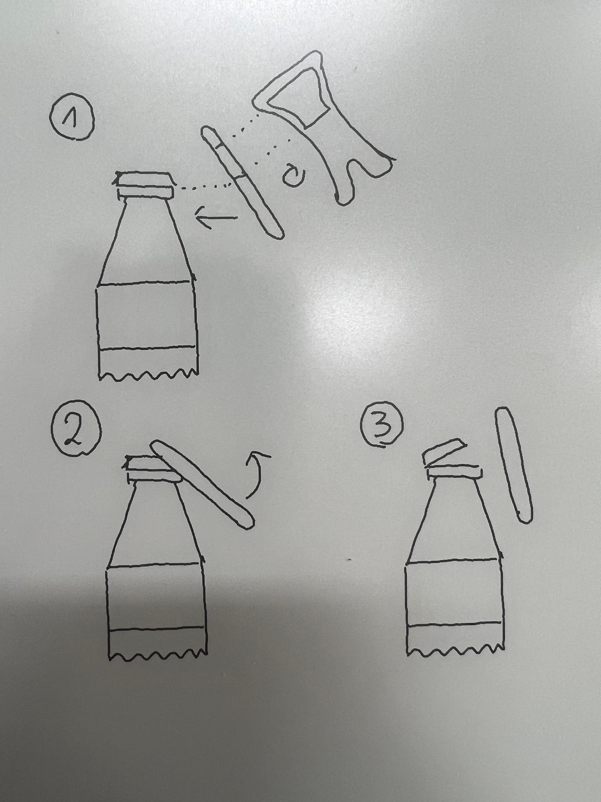

# Zkuste napsat "koncept" otvírák na pivo

## Koncept
### Český korunkový otvírák na pivo pozinkovaný

Český korunkový ovírák na pivo je nástroj sloužící k otevření lahvového piva nebo jiného zazátkováného nápoje s korunkovou zátkou.
Jedná o výrobek bez pohyblivých částí vyrobený z jednoho kusu povrch je galvanicky pozinkován pro ochranu vůči korozí.
Je vyroben z plechu o síle 1,5 mm. Produk je vyroben v České republice.
Výrobek nevystavujte extrémním teplotám (-20°C - 40°C) a vlhkosti.
Vhodný do kuchyně, restaurace, hospody, pivnice, kavárny, bary nebo jen tak do kapsy (nedoporučujeme nosit v kapse s předměty kterým hrozí mechanické poškození - škrábance, vrypy,...).

## Pracovní postup
Otvírák přiložíme hranou k zátce na lahvi. Pohybem ruky přitlačíme otvírák k zátce a následně pohybem směrem nahoru vypáčíme zátku.

## Reference
- funkce otevření zátky 

## Katalogový list

### Český korunkový otvírák na pivo pozinkovaný
- Materiál: ocelový plech typu 1.4301
- Tloušťka plechu: 1,5 mm
- Rozměry: 8,5 x 4,5 x 1,5 cm

## Turiál
Jak otevřít pivo?
1. Použitím otvíráku
   Otvírák je nástroj sloužící k otevření lahvového piva nebo jiného zazátkováného nápoje s korunkovou zátkou. Takže pokud máte otvírák u sbee, tak je to nejjednoduší způsob jak se dostat do lahve. Stačí otvírák přiložit k zátce a pohybem směrem nahoru vypáčit zátku.

2. Jinou lahví
   Stačí si vzí zazátkovanou lahev a přiložit ji pod úhlem 70° k zátce lahve kterou chcem otevřít. Tu si chytne rukou těsně pod hrdlem a budeme ji používat jako bod naší páky. Je nutné lahev držet pevně v ruce a optimálně tlačit na zátku, tak aby při následném páčení vůči ruce zátka povolila. Na poprvé to třeba nepůjde, ale s praxí to bude fungovat. A tréning dělá mistra.

3. Jakým koli jiným nástrojem
    Pokud máte nějaký jiný nástroj, který má vysokou pevnost a je schopen zatlačit zátku, tak to můžete použít k otevření piva stejný postup jako s lahví. 

4. Hranou
   Když už vám nic jiného nezbývá, tak můžete zátku otevřít hranou. Stačí zátku přiloži k hraně a dlaní udeřit do vrchní části zátky.

## Autoři
@KNajman @FilipGlenda